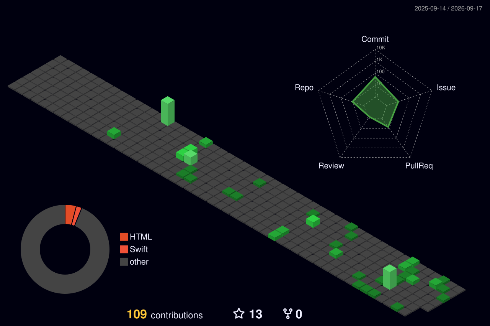

# Hi, I'm Lokesh 👋

### Embedded Systems & Firmware Developer

> Building reliable firmware and reusable embedded software.

🌐 **Portfolio:** https://lokeshpanditi.qzz.io

---

## ⟢ About

Passionate about embedded systems, low-level programming, computer architecture, and real-time software.

I enjoy building open-source frameworks that are portable, efficient, and hardware-independent.

**Currently exploring Ada for Embedded Systems and building my own Ada Eco-system.**

---

## ⟢ Tech Stack

**Languages**

C • C++ • Ada • ARM64 Assembly • Rust • Python

**Microcontrollers**

ESP32 • RP2040

---

## ⟢ Open Source Projects

| Project | Status | Description | Language |
| :------ | :----: | :---------- | :------: |
| ✦ **Glyph** | ✅ Published | Portable graphics framework with a hardware-independent rendering API and display drivers. | Ada |
| 🕸️ **Web_Kit** | 🚧 Active | A lightweight and beginner-friendly web framework. | Ada|
| ⌗ **Sensor_Kit** | 🚧 Active | Hardware-independent sensor framework with a unified API for embedded applications. | Ada |
| ∿ **Radio_Kit** | 📌 Planned | Radio framework for RP2040 enabling wireless signal transmission without an RF transceiver. | Ada |
| ⌬ **Loom** | 📌 Planned | Cooperative task scheduler for resource-constrained microcontrollers with deterministic execution. | Ada |
| ➤ **Flight_Kit** | 📌 Planned | Flight software framework for avionics and embedded systems with reusable components. | Ada |

---

## ⟢ Let's Connect

  
  &nbsp;
  
  &nbsp;
  
  &nbsp;
  

---

  

